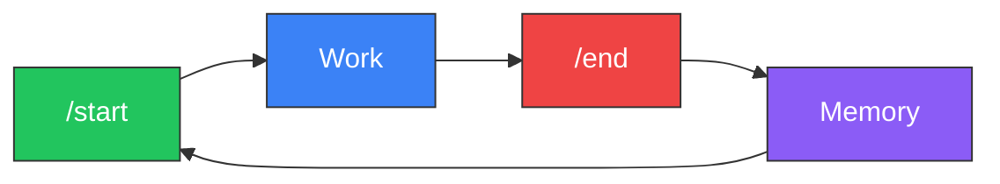

<div align="center">

# Project Athena

**Your memory. Your machine. Any model.**

Open-source AI personalisation layer that gives you persistent memory, structured reasoning, and full data ownership — across ChatGPT, Claude, Gemini, and any model you switch to next.

Platforms forget. Athena doesn't.

[](https://github.com/winstonkoh87/Athena-Public/stargazers)
[](LICENSE)
[](docs/CHANGELOG.md)
[](https://www.reddit.com/r/ChatGPT/comments/1r1b3gl/)
[](https://codespaces.new/winstonkoh87/Athena-Public)

[Quickstart](#-quickstart) · [How It Works](#-how-it-works) · [Docs](docs/GETTING_STARTED.md) · [FAQ](docs/FAQ.md) · [Contributing](CONTRIBUTING.md)

*Last updated: 28 February 2026*

</div>

---

## The Problem

You've spent months training ChatGPT to understand you. Then a model update resets the personality. Your custom instructions stop working. You can't find that conversation from last Tuesday. And if you switch to Claude or Gemini? **You start from zero.**

Platform memory is **unreliable, opaque, and locked to one provider**. You don't own it, you can't inspect it, and you can't take it with you.

## Why Athena?

Athena moves the memory layer to **your machine**. Plain Markdown files that you own, version-control, and point at any model.

- **🧠 Your Memory, Your Machine** — Files on your disk, not in OpenAI's cloud. Read them, edit them, git-version them.
- **🔌 Switch Models Freely** — Claude today, Gemini tomorrow, GPT next week. The memory stays. The model is just whoever's on shift.
- **📈 It Compounds** — Session 500 recalls patterns from session 5. Platform memory decays; Athena's doesn't.
- **⚡ ~10K Token Boot** — 95% of your context window stays free, even after 10,000 sessions.
- **🛡️ Governed Autonomy** — 6 constitutional laws, 4 capability levels, bounded agency.

> *The LLM is the engine. Athena is the chassis, the memory, and the rules of the road. Swap the engine anytime — the car remembers every road you’ve driven.*

---

## "…But doesn't ChatGPT / Gemini / Claude already do this?"

Kind of. But there's a difference between *remembering your name* and *thinking in your frameworks*:

| Capability | Platform Memory (ChatGPT, Gemini, Claude) | Athena |
|:-----------|:------------------------------------------|:-------|
| **Who owns the data?** | The platform | **You** |
| **Can you inspect it?** | No — it's a black box | Yes — it's markdown files you can read and edit |
| **Can you search it?** | Vague recall, no precision | Full semantic + keyword search with file links |
| **Cross-platform?** | Locked to one provider | Same memory works across Claude, Gemini, GPT, Grok |
| **Version history?** | None — no rollback, no audit trail | Full `git log`, `git diff`, `git blame` |
| **What if you switch providers?** | Start over | Nothing changes — your data stays |

> **💡** Think of platform memory like photos on Instagram — you can view them, but you don't own them, can't move them, and can't search them precisely. Athena is keeping the originals on your hard drive, with albums, metadata, and full edit history.

### "How is Athena different from...?"

| Tool | What It Does | How Athena Is Different |
|:-----|:-------------|:------------------------|
| **ChatGPT Projects** | Uploads files per-project, but resets every new chat. Locked to OpenAI. | Athena persists across *all* chats, *all* models, with full version history. |
| **OpenClaw** | Prompt distribution — share and discover prompts. | Athena is **personalisation** — your compounding memory system, not a prompt marketplace. Different layer, different problem. |
| **Claude Code** | Great for Claude coding workflows. | Athena works across *any* model and *any* IDE. Not coding-specific — used for research, strategy, writing, life management. |
| **Gemini Gems** | Custom chatbots inside Gemini. | Gems are locked to Gemini and lose context between chats. Athena is portable and persistent. |
| **Custom Instructions** | 1,500-character personality prompt. | Athena loads ~10K tokens of structured protocols, decision frameworks, and session history — re-injected every session from your disk. |

---

<details>
<summary><strong>🧬 Why Thousands of Files?</strong></summary>

Athena's workspace looks unusual — **6,000+ Markdown files** and **1,000+ Python scripts** instead of one big config. **This is deliberate.**

AI agents don't read files top-to-bottom like humans. They **query** — by filename, semantic search, or tag lookup. Each small file is an **addressable memory node** the agent can retrieve surgically, without loading everything else.

| Principle | What It Means |
|:----------|:-------------|
| **JIT Loading** | Boot at ~10K tokens. Load specific files only when the query demands them. A monolith forces the full context into every session. |
| **Zero Coupling** | A marketing protocol loads without touching the trading stack. Change one file, break nothing else. |
| **Surgical Retrieval** | The agent pulls `CS-378-prompt-arbitrage.md` by name — not page 47 of a 200-page doc. The file system *is* the index. |
| **Git-Friendly** | Atomic diffs per file. Clean commit history. No merge conflicts from a single giant file. |
| **Composable Agents** | Swarms, workflows, and skills are mix-and-match. Each file is a Lego brick, not a chapter in a novel. |

> *A monolith is optimized for a human reading a book. A modular workspace is optimized for an agent querying a database. Athena chose the agent.*

</details>

---

## ⚡ Quickstart

**Works on macOS, Windows, and Linux.**

### 1. Clone the repo

```bash
git clone https://github.com/winstonkoh87/Athena-Public.git
cd Athena-Public
```

Clone it anywhere you keep projects (e.g. `~/Projects/`). This folder **is** your Athena workspace — your memory, protocols, and config all live here.

### 2. Install the SDK *(optional — enables CLI commands)*

```bash
# Recommended
uv pip install -e .

# Or with pip
pip install -e .
```

> ⚠️ **Don't `pip install athena-cli`** — that's a different, unrelated package. Always install from inside the cloned repo.

### 3. Open the folder in an AI-enabled IDE

Open the `Athena-Public/` directory as your **workspace root** in one of these editors:

- [Antigravity](https://antigravity.google/) · [Cursor](https://cursor.com) · [Claude Code](https://docs.anthropic.com/en/docs/claude-code) · [VS Code + Copilot](https://code.visualstudio.com/) · [Kilo Code](https://kilocode.ai/) · [Gemini CLI](https://github.com/google-gemini/gemini-cli)

> [!IMPORTANT]
> **Athena does NOT work through ChatGPT.com, Claude.ai, or Gemini web.** You need an app that can **read files from your disk**. Think of Athena as a workspace for your editor, not a plugin for a chatbot.

> [!NOTE]
> **"Why do I open the Athena folder instead of my own project?"** — Athena is a *workspace*, not a library you install into another repo. You work *inside* the Athena folder, and it remembers everything across sessions. To work on external projects, reference them from within Athena or use multi-root workspaces in your IDE.

### 4. Boot (in the AI chat panel — not the terminal)

In your IDE's **AI chat panel** (e.g. Cmd+L in Cursor, the chat sidebar in Antigravity), type:

```
/start
```

> [!CAUTION]
> `/start`, `/end`, and `/tutorial` are **AI chat commands** — you type them in the chat window where you talk to the AI, **not** in the terminal. They are slash commands that the AI agent reads and executes.

### 5. First time? Take the guided tour

```
/tutorial
```

This walks you through everything: what Athena is, how it works, builds your profile, and demos the tools (~20 min). Confident users can skip it.

### 6. When you're done

```
/end
```

**That's it.** No API keys. No database setup. The folder *is* the product.

> [!CAUTION]
> **Forks of public repos are public by default.** If you plan to store personal data (health records, finances, journals), **create a new private repo** instead of forking. Copy the files manually or use `git clone` + `git remote set-url` to point to your private repo. [GitHub docs on fork visibility →](https://docs.github.com/en/pull-requests/collaborating-with-pull-requests/working-with-forks/about-permissions-and-visibility-of-forks)

> [!TIP]
> See the [full setup guide →](docs/YOUR_FIRST_SESSION.md) for detailed walkthroughs and troubleshooting.

---

## 🔄 How It Works

Every session follows one cycle: **`/start` → Work → `/end`**. Each cycle deposits structured memory. Over hundreds of cycles, the AI stops being generic and starts thinking like *you*.



| Sessions | What Happens |
|:---------|:------------|
| **1–50** | Basic recall — remembers your name, project, preferences |
| **50–200** | Pattern recognition — anticipates your style and blind spots |
| **200+** | Deep sync — thinks in your frameworks before you state them |

### The Linux Analogy

| Concept | Linux | Athena |
|:--------|:------|:-------|
| Kernel | Hardware abstraction | Memory persistence + retrieval (RAG, Supabase) |
| File System | ext4, NTFS | Markdown files, session logs, tag index |
| Scheduler | cron, systemd | Heartbeat daemon, auto-indexing |
| Shell | bash, zsh | MCP Tool Server, `/start`, `/end`, `/think` |
| Permissions | chmod, users/groups | 4-level capability tokens + Secret Mode |
| Package Manager | apt, yum | Protocols, skills, workflows |

---

## 📦 What's In The Box

Everything you need to turn a generic AI into **your** AI — pre-configured, no assembly required.

| Component | What It Does For You |
|:----------|:---------------------|
| 🧠 **Core Identity** | Your AI's personality, principles, and boundaries — editable, version-controlled — [template](examples/templates/core_identity_template.md) |
| 📋 **125+ Protocols** | Ready-made decision frameworks (risk analysis, research, strategy) across 14 categories — [browse](examples/protocols/) |
| ⚡ **50+ Slash Commands** | One-word triggers: `/start`, `/end`, `/think`, `/research` — [full list](docs/WORKFLOWS.md) |
| 🔍 **Smart Search** | Finds the right memory even if you describe it vaguely (5 sources, auto-ranked) — [how it works](docs/SEMANTIC_SEARCH.md) |
| 🔌 **Tool Integration** | Your agent can search, save, and execute scripts on your behalf — [docs](docs/MCP_SERVER.md) |
| 🛡️ **Safety Rails** | Controls what the AI can and can't do autonomously (4 levels, from read-only to full agency) — [security](docs/SECURITY.md) |

> [!TIP]
> Run `/tutorial` on your first session for a guided walkthrough (~20 min). It explains everything above and builds your personal profile.

### Agent Compatibility

Athena works through **AI-enabled code editors** — apps that connect to AI models while reading your local files. It does **not** work through ChatGPT.com, Claude.ai, or Gemini web — those are closed sandboxes that can't read your disk.

| Agent | Status | Init Command |
|:------|:------:|:-------------|
| [Claude Code](https://docs.anthropic.com/en/docs/claude-code) | ✅ | `athena init --ide claude` |
| [Antigravity](https://antigravity.google/) | ✅ | `athena init --ide antigravity` |
| [Cursor](https://cursor.com) | ✅ | `athena init --ide cursor` |
| [Gemini CLI](https://github.com/google-gemini/gemini-cli) | ✅ | `athena init --ide gemini` |
| [VS Code + Copilot](https://code.visualstudio.com/) | ✅ | `athena init --ide vscode` |
| [Kilo Code](https://kilocode.ai/) | ✅ | `athena init --ide kilocode` |
| [Roo Code](https://roocode.com/) | ✅ | `athena init --ide roocode` |

> More agents planned — [full compatibility list →](docs/COMPATIBLE_IDES.md)
>
> **"How is this different from ChatGPT Projects?"** — Projects reset every new chat and are locked to one platform. Athena persists across *all* chats, *all* models, with full version history. [Details →](docs/FAQ.md)

---

## 🎯 Use Cases

| | Use Case | What It Looks Like |
|:-|:---------|:-------------------|
| 🏠 | **Life Management** | Daily routines, health tracking, pet care, family scheduling — [see how one user built a full life OS in 72 hours](docs/CASE_STUDIES.md) |
| 💼 | **Work & Projects** | Switch between multiple client projects without losing context. Meeting prep, cross-team knowledge, shift scheduling. |
| ✍️ | **Writing & Voice** | After 30 sessions, the AI stops sounding like ChatGPT and starts sounding like *you*. Learns your style from your own writing samples. |
| 🎯 | **Decision-Making** | *"Should I take this job offer?"* — answered using your actual risk tolerance, career goals, and decision history. |
| 🔬 | **Research & Synthesis** | Compile 200 sources into one framework — still searchable and citable 6 months later. |
| 📐 | **Strategic Planning** | Long-term planning across dozens of sessions. Budget modeling, scenario analysis, with full context of your past decisions. |

> **Not just for coding.** Athena is used for personal knowledge management, health tracking, creative writing, business strategy, and daily life — by people who've never written a line of code.

---

## 💰 Cost

**Athena is free. Forever. MIT licensed.** You only pay for the AI subscription you're probably already paying for.

| Plan | Cost | Who It's For |
|:-----|:-----|:-------------|
| **Google Antigravity (free tier)** | **$0** | **Try Athena first** — included with any Google account |
| Claude Pro / Google AI Pro | ~$20/mo | Daily users — the sweet spot for most people |
| Claude Max / Google AI Ultra | $200+/mo | Power users managing multiple domains (8+ hrs/day) |

> **Try before you buy.** Athena works with Google Antigravity's free tier — clone the repo, type `/start`, and see if it clicks. No credit card, no trial period, no catch. Upgrade only when you hit the free tier's daily limits.

> Boot cost is ~10K tokens — constant whether it's session 1 or session 10,000. [Details →](docs/BENCHMARKS.md)

> [!NOTE]
> Athena works with any model, but governance protocols and multi-step reasoning perform best with frontier models (e.g. Claude Opus 4.6, Gemini 3.1 Pro, GPT-5.3). Start with the free tier to test compatibility with your preferred model.

---

## 📚 Documentation

| | | |
|:--|:--|:--|
| 📖 [Getting Started](docs/GETTING_STARTED.md) | 🏗️ [Architecture](docs/ARCHITECTURE.md) | 🔒 [Security](docs/SECURITY.md) |
| 🎯 [Your First Session](docs/YOUR_FIRST_SESSION.md) | 🔍 [Semantic Search](docs/SEMANTIC_SEARCH.md) | 📊 [Benchmarks](docs/BENCHMARKS.md) |
| 💡 [Tips](docs/TIPS.md) | 🔌 [MCP Server](docs/MCP_SERVER.md) | ❓ [FAQ](docs/FAQ.md) |
| 🔄 [Updating Athena](docs/UPDATING.md) | 📥 [Importing Data](docs/IMPORTING.md) | ⌨️ [CLI Reference](docs/CLI.md) |
| 📋 [All Workflows](docs/WORKFLOWS.md) | 📐 [Spec Sheet](docs/SPEC_SHEET.md) | 📓 [Glossary](docs/GLOSSARY.md) |
| 🧠 [Manifesto](docs/MANIFESTO.md) | 📈 [Changelog](docs/CHANGELOG.md) | 🔀 [Multi-Model Strategy](docs/MULTI_MODEL_STRATEGY.md) |
| ✅ [Best Practices](docs/BEST_PRACTICES.md) | 🤖 [Your First Agent](docs/YOUR_FIRST_AGENT.md) | 🧩 [What Is an AI Agent?](docs/WHAT_IS_AN_AI_AGENT.md) |

---

## 🛠️ Tech Stack

| Layer | Technology |
|:------|:----------|
| **SDK** | `athena` Python package (v9.2.8) |
| **Search** | Hybrid RAG — FlashRank reranking + RRF fusion |
| **Embeddings** | `text-embedding-004` (768-dim) |
| **Memory** | Supabase + pgvector / local ChromaDB |
| **Routing** | Risk-Proportional Triple-Lock — SNIPER / STANDARD / ULTRA |

<details>
<summary><strong>📂 Repository Structure</strong></summary>

```text
Athena-Public/
├── src/athena/              # SDK package (pip install -e .)
│   ├── core/                #   Config, governance, permissions, security
│   ├── tools/               #   Search, agentic search, reranker, heartbeat
│   ├── memory/              #   Vector DB, delta sync, schema
│   ├── boot/                #   Orchestrator, loaders, shutdown
│   ├── cli/                 #   init, save, doctor commands
│   └── mcp_server.py        #   MCP Tool Server (9 tools, 2 resources)
├── scripts/                 # Operational scripts (boot, shutdown, launch)
├── examples/
│   ├── protocols/           # 125+ starter frameworks (14 categories)
│   ├── scripts/             # 120+ reference scripts
│   └── templates/           # Starter templates (framework, memory bank)
├── docs/                    # Architecture, benchmarks, security, guides
└── pyproject.toml           # Modern packaging
```

</details>

<details>
<summary><strong>📋 Recent Changelog</strong></summary>

- **v9.2.8** (Feb 27 2026): Skill Template Expansion — 5 starter skill templates across 4 categories for new AG users
- **v9.2.7** (Feb 26 2026): Risk-proportional Triple-Lock, Tier 0 context summaries, 3 new academic citations
- **v9.2.6** (Feb 25 2026): Kilo Code + Roo Code IDE integration, `COMPATIBLE_IDES.md`, issue #19 closed
- **v9.2.5** (Feb 24 2026): Life Integration Protocol Stack — Protocols 381-383, Emotional Audit, `/review` workflow
- **v9.2.3** (Feb 21 2026): Multi-agent safety hardening, CLAUDE.md symlinks, issue deflection
- **v9.2.2** (Feb 21 2026): S-tier README refactor, docs restructure
- **v9.2.1** (Feb 20 2026): Deep Audit & PnC Sanitization — 17 patterns sanitized across 13 files
- **v9.2.0** (Feb 17 2026): Sovereignty Convergence — CVE patch, agentic search, governance upgrade
- **v9.1.0** (Feb 17 2026): Deep Audit & Sync — Fixed 15 issues (dead links, version drift)
- **v9.0.0** (Feb 16 2026): First-Principles Workspace Refactor — root dir cleaned, build artifacts purged

👉 [Full Changelog →](docs/CHANGELOG.md)

</details>

---

<div align="center">

### 🌟 Star History

[](https://star-history.com/#winstonkoh87/Athena-Public&Date)

**MIT License** · [Contributing](CONTRIBUTING.md) · [Security](SECURITY.md) · [Code of Conduct](CODE_OF_CONDUCT.md)

*Clone it. Boot it. Make it yours.*

</div>
