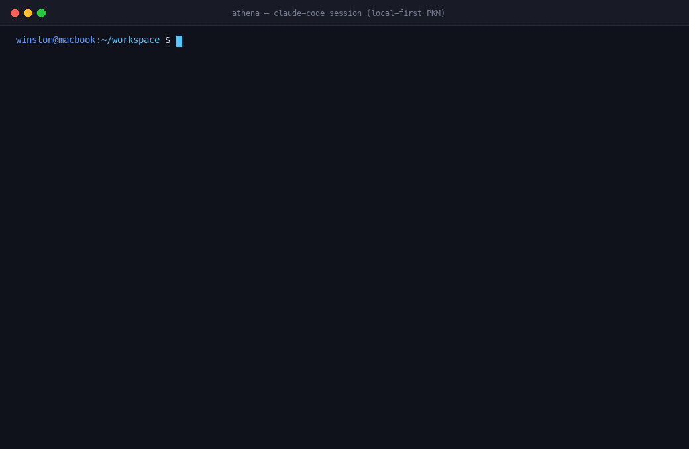

<div align="center">

# Project Athena

**The compounding context layer for AI coding agents, portable across IDEs.**

*Own the state. Rent the intelligence.*

Plain Markdown on your disk, driven by an automated session routine that turns today's work into what tomorrow's agent already knows. Swap models or switch IDEs on a whim. The intelligence is rented; the state belongs to you.

[](https://github.com/winstonkoh87/Athena-Public/actions/workflows/ci.yml)
[](https://pypi.org/project/athena-agent/)
[](LICENSE)
[](https://github.com/winstonkoh87/Athena-Public/stargazers)



[Quickstart](#quickstart) · [How It Works](#how-it-works) · [What Moves Between Tools](#what-moves-between-tools) · [Docs](docs/GETTING_STARTED.md) · [Why Athena?](docs/WHY_ATHENA.md) · [Safety](SAFETY.md)

</div>

---

## The Problem

You switch between Claude Code, Cursor, and Antigravity, and each one starts from zero. Rules files hold instructions, not memory. Memory features inside platform chats stay behind in the browser. A folder of Markdown on your disk doesn't get smarter by sitting there.

Without an active distillation loop, every session starts from scratch.

Project Athena provides that layer. Your memory lives in plain Markdown files on your disk, following an open structure. A fixed session routine keeps them current. Any coding agent can read them. You keep them.

| System | Builds up across sessions | Portable across IDEs | Your files, any model |
|:-------|:--------------------------|:---------------------|:----------------------|
| **Platform memory** (ChatGPT, Claude web) | ✅ | ❌ Locked to web UI | ❌ Hosted |
| **CLAUDE.md / AGENTS.md alone** | ❌ Static instructions | ✅ | ✅ Plain Markdown |
| **Cline Memory Bank** | ✅ In-session prompts | 🟡 Cline-centric | ✅ Plain Markdown |
| **Project Athena** | ✅ Session routine (`/start`, `/end`) | ✅ Multi-IDE shims | ✅ Plain Markdown |

*Lineage: Project Athena's memory bank files (`userContext`, `productContext`, `activeContext`, `systemPatterns`) build upon the foundational open architecture introduced by [Cline Memory Bank](https://docs.cline.bot/features/memory-bank), adding multi-IDE portability, session lifecycle automation, and canonical fact tracking.*

## Quickstart

```bash
git clone https://github.com/winstonkoh87/Athena-Public.git && cd Athena-Public
python3 -m venv .venv && source .venv/bin/activate
pip install -e ".[local]"               # lightweight install
athena init --ide claude                # or: antigravity, cursor, gemini, vscode, kilocode, roocode
athena doctor                           # expect 0 failures
```

Open your IDE and start chatting. In hook-enabled environments (Claude Code, Antigravity), `/start` boots automatically on your first message—zero warmup ritual. In other tools, just type `/start`. Work normally, then type `/end` to distill and save.

> **Full install** (cloud sync + reranking): `pip install -e ".[full]"`  
> **Note on dependencies**: Minimal extras for local use. Cloud SDKs (Supabase, Anthropic) are installed in base dependencies for hybrid search; full decoupling is scheduled in v10.1.  
> See [Getting Started](docs/GETTING_STARTED.md) for Windows, advanced config, and Supabase setup.  
> Already have history elsewhere? See [Importing](docs/IMPORTING.md) for instructions.

## How It Works

### The skeleton

Your workspace starts with a clean memory directory. You build context by working:

```
.context/
├── memory_bank/
│   ├── userContext.md       # who you are and how you work
│   ├── productContext.md    # what you're building, and why
│   ├── activeContext.md     # where you left off: session checkpoints
│   └── systemPatterns.md    # architectures and patterns that keep working
├── memories/session_logs/   # session logs created at /start, finalized at /end
└── project_state.md         # active tasks and milestones
```

### The loop

1. **Zero-touch boot**: Loads about 2K tokens (who you are, and your last checkpoint). Automatically triggered on session start in supported tools, or run via `/start`.
2. **Work normally**: Full context window stays free for your actual code.
3. **One-command distillation**: `/end` writes the session log, appends a checkpoint to `activeContext.md`, and updates `CANONICAL.md` when confirmed facts change.

Session 50 starts where session 49 stopped. Short on tokens? Skip boot and just `/end` (~500 tokens).

### The layers

```
┌─────────────────────────────────────────────────────┐
│  Your IDE (Claude Code / Antigravity / Cursor / …)  │
└───────────────────┬─────────────────────────────────┘
                    │ rules file (all IDEs) + hooks (Claude Code)
                    ▼
┌─────────────────────────────────────────────────────┐
│  Project Athena SDK                                 │
│  ├── Lifecycle: /start loads ~2K tokens, /end saves │
│  ├── Memory: session logs + canonical facts         │
│  ├── Search: hybrid (keyword + optional vectors)    │
│  └── Guardrails: ruin check, secret scan, grounding │
└───────────────────┬─────────────────────────────────┘
                    │
                    ▼
┌─────────────────────────────────────────────────────┐
│  Your Disk (plain Markdown — git-versioned)         │
│  └── Optional: Supabase pgvector for cloud sync     │
└─────────────────────────────────────────────────────┘
```

## What Moves Between Tools

Your memory files and the `/start`–`/end` routine are Markdown, so they go wherever you go. Guardrails are different: they run as hooks, hooks are tool-specific, and today they're wired in code for Claude Code. In other tools, the same rules exist as instructions the model is asked to follow, not code that stops it.

| Tool | `athena init --ide` writes | Rules file loaded | Guardrail hooks | Load path status |
|:-----|:---------------------------|:------------------|:----------------|:-----------------|
| **Claude Code** | `claude` → `CLAUDE.md` | ✅ Loaded | 🟡 Clone only (installed hook in progress) | ✅ Verified |
| **Antigravity** | `antigravity` → `AGENTS.md` | ✅ Loaded | ❌ Rules only | ✅ Verified |
| **Cursor** | `cursor` → `.cursor/rules.md` | 🟡 Needs `.cursor/rules/*.mdc` (Phase 3) | ❌ Rules only | 🟡 In progress |
| **Gemini CLI** | `gemini` → `.gemini/AGENTS.md` | 🟡 Reads `GEMINI.md` / `AGENTS.md` (Phase 3) | ❌ Rules only | 🟡 In progress |
| **VS Code + Copilot** | `vscode` → `.vscode/settings.json` | 🟡 Needs `.github/copilot-instructions.md` | ❌ Rules only | 🟡 In progress |
| **Kilo Code** | `kilocode` → `.kilocode/rules/athena.md` | ✅ Loaded | ❌ Rules only | ✅ Verified |
| **Roo Code** | `roocode` → `.roo/rules/athena.md` | ✅ Loaded | ❌ Rules only | ✅ Verified |
| **Codex** | Untested target; reads `AGENTS.md` | 🟡 Native `AGENTS.md` | ❌ Rules only | ❌ Untested |

The four Claude Code hooks (configured in `.claude/settings.json`): a secret scan before file reads and edits, a ruin check before shell commands, a meta-awareness gate on each prompt, and an output check (math leaks, secrets, Python syntax) before each turn ends.

### What's enforced in code vs. by prompt

> *Most AI-agent READMEs state every claim in the same confident voice. This one doesn't.*

| Claim | Status | Evidence |
|:------|:-------|:---------|
| **Storage & retrieval** — memories stored and surfaced when relevant | ✅ Shipped | Hybrid RAG with cross-encoder rerank, hardened through [production failures](docs/CHANGELOG.md) |
| **Portability** — memory and routine move across models and tools | ✅ Shipped | Plain Markdown; see [What Moves Between Tools](#what-moves-between-tools) |
| **Governed autonomy** — hooks block destructive commands and secrets | 🟡 Claude Code only | Blocks canonical destructive commands (`rm -rf`, force-push, `reset --hard`); regex-based, bypasses tracked in test suite |
| **Compounding (/end writes checkpoint + CANONICAL)** | 🟡 Prompt-level | Model appends checkpoints based on workflow prompt; code-enforced writer in development |
| **Compounding personalization** — session 500 recalls session 5 | 🟡 N=1 evidence | 1,900+ sessions by the author; no multi-user study |
| **Anti-sycophancy** — personalization doesn't silently increase agreement | 🟡 Partial mitigation | Code-enforced meta-awareness gate (Claude Code only); see [honest limits](docs/ENGINEERING_DEPTH.md) |

> **Why publish this table?** Because the failure mode of this product category is self-mythologizing — describing aspirations in the present tense. Project Athena's own convention ([Epistemic Status](examples/workflows/_shared.md#epistemic-status-convention-anti-self-mythologizing)) requires labeling every mechanism as `code-enforced`, `agent-discretion`, or `aspirational`. This table is that convention applied to the README.

## Measured, Not Claimed

```bash
# Run the tests yourself
pytest tests/ -v --tb=short

# Run the retrieval evaluator yourself (requires Supabase keys and indexed corpus)
python examples/scripts/evaluator.py
```

| Metric | Value | Verification Command |
|:-------|:------|:---------------------|
| **Retrieval Hit@5 (Strict)** | **0.569** (37 / 65) | `python examples/scripts/evaluator.py` (author-measured on 1,900-session corpus) |
| **Retrieval MRR@5 (Strict)** | **0.472** | `python examples/scripts/evaluator.py` (author-measured on 1,900-session corpus) |
| *Retrieval Hit@5 (Lenient)* | *0.892 (deprecated)* | *Partial substring match (inflated)* |
| **Unit & Integration Tests** | 630 passed, 7 skipped | `pytest tests/` |
| **Secret Leaks (840+ commits)** | 0 detected | Gitleaks in CI |
| **Code Quality & Lints** | 0 ruff findings | `ruff check src/` |

> **Anti-Goodhart Invariant**: Why did our reported Hit@5 shift from 0.89 to 0.57? Lenient substring matchers count partial word overlaps as "hits," inflating benchmark scores by ~36% without improving retrieval. We killed the lenient matcher because vanity metrics mask regressions. See the full breakdown: [Anti-Goodhart Benchmarking in RAG](docs/BENCHMARKS.md#the-anti-goodhart-shift-why-we-published-lower-numbers).

## Documentation

| Doc | What it covers |
|:----|:---------------|
| [Getting Started](docs/GETTING_STARTED.md) | Install, configure, first session |
| [Your First Session](docs/YOUR_FIRST_SESSION.md) | 20-minute guided tutorial |
| [Importing](docs/IMPORTING.md) | Bring in ChatGPT, Claude or Gemini exports |
| [How It Works](docs/ARCHITECTURE.md) | Architecture and search pipeline |
| [Why Athena?](docs/WHY_ATHENA.md) | Philosophy, use cases, cost analysis |
| [Engineering Depth](docs/ENGINEERING_DEPTH.md) | Technical deep dives |
| [CLI Reference](docs/CLI.md) | All commands |
| [FAQ](docs/FAQ.md) | Common questions |
| [Safety](SAFETY.md) | Limitations and responsible use |
| [Changelog](docs/CHANGELOG.md) | Release history |

## Contributing

PRs welcome. Please read [CONTRIBUTING.md](CONTRIBUTING.md) first.

The codebase uses `ruff` for linting, `pytest` for tests, and CI must pass before merge.

---

<div align="center">

**MIT License** · [Contributing](CONTRIBUTING.md) · [Safety](SAFETY.md) · [Security](docs/SECURITY.md) · [Code of Conduct](CODE_OF_CONDUCT.md)

Built and battle-tested solo across 1,900+ sessions by [Winston Koh](https://winstonkoh87.com).

*Clone it. Boot it. Make it yours.*

</div>
