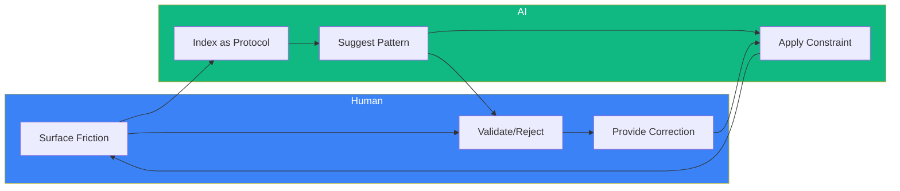
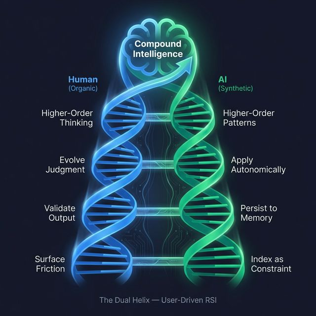

# Symbiotic RSI (User-Driven Recursive Self-Improvement)

> **Last Updated**: 21 March 2026
> **TL;DR**: AI doesn't improve itself. You improve together. The loop is bilateral, and the trajectory is a dual upward spiral. After Phase 1 (building the AI), the bottleneck shifts to Phase 2 (optimising the human).

> [!IMPORTANT]
> **Core Thesis**: Neither human nor AI can recursively self-improve alone. Intelligence compounds at the *interface* — in the coupling data between human judgment and AI reasoning. The moat is not the code. The moat is the 1,200+ sessions of calibration that make the code *yours*.

---

## The Common Misconception

The AI hype narrative claims:
> "AI will improve itself → AGI → Singularity → Humans irrelevant"

**Reality in 2026:**
> AI is a high-leverage tool that *amplifies* human judgment. The loop is bilateral. The human provides direction, taste, and correction. The AI provides scale, speed, and pattern-matching.

---

## The Bilateral Loop

1. **You** → Surface friction → **AI** indexes it as a protocol
2. **AI** → Suggests pattern → **You** validate or reject
3. **You** → Correct the AI → **AI** learns the constraint
4. **AI** → Applies constraint → **You** get better output
5. **Repeat 1000 sessions** → Compound Intelligence

---

## The Dual Helix: Two Spirals, One Trajectory

The bilateral loop above shows the *mechanism*. But the *trajectory* is something more: **two intertwined upward spirals** — one organic, one synthetic — each supporting the other's ascent.

> Inspired by Stephen Covey's **Learn → Commit → Do** upward spiral, applied to a bionic (human + AI) system.

### The Human Spiral (Organic)

| Phase | Action | Example |
|:------|:-------|:--------|
| **Learn** | Discover a friction or gap | "Dead links confuse new users" |
| **Commit** | Decide to fix it, choose direction | "Ship templates, not just docs" |
| **Do** | Validate the output, correct mistakes | "This is wrong — rollback" |

### The AI Spiral (Synthetic)

| Phase | Action | Example |
|:------|:-------|:--------|
| **Learn** | User correction becomes a constraint | "Never reference files that don't exist in public repo" |
| **Commit** | Constraint is persisted to memory | Session log, case study, protocol update |
| **Do** | Next session applies constraint *autonomically* | User doesn't have to ask again |

### Why Neither Spiral Works Alone

| Configuration | Outcome |
|:-------------|:--------|
| Human alone (no AI) | Slow iteration, 3+ years to ship |
| AI alone (no human) | Generic, uncalibrated, technically competent but tasteless |
| **Dual helix (both)** | **Compounding intelligence — 3 months to ship what would take 3 years** |

The DNA metaphor is precise: one strand is the **template** (your judgment, taste, correction) and the other is the **complement** (AI's execution, recall, scale). Neither strand carries information on its own. **The information is in the pairing.**

This is why the "AI replaces humans" narrative is structurally wrong. It's not replacement — it's **base-pairing**. Remove one strand and the helix collapses.

---

## The Thermodynamic Frame

> *Athena is a thermodynamic open system: it converts compute energy into structural negentropy.*

Entropy is the natural state of information systems — context decays, decisions are forgotten, lessons are re-learned from scratch. Every vanilla LLM session starts at maximum entropy (zero context). Every Athena session starts at *reduced* entropy because prior sessions have been compressed into persistent structure (protocols, case studies, canonical memory).

| Concept | Physics | Athena |
|:--------|:--------|:-------|
| **Entropy** | Disorder increases over time | Context decays, decisions forgotten, lessons re-learned |
| **Energy Input** | External energy reduces local entropy | Compute (AI) + judgment (human) reduce context entropy |
| **Negentropy** | Ordered structure maintained against decay | 397 protocols, 410+ case studies, calibrated memory |
| **Open System** | Exchanges energy with environment | Each session imports compute, exports structured knowledge |

Over 1,200+ sessions, the entropy reduction approaches near-zero — the system "knows" the user's frameworks, risk tolerances, decision patterns, and blind spots with minimal re-derivation. This is thermodynamically precise: the coupling data *is* the negentropy.

**Why this matters for RSI**: Unilateral AI self-improvement (the AI rewriting its own code) is a *closed system* — it can only rearrange existing information. Symbiotic RSI is an *open system* — human judgment injects genuinely new information (taste, correction, lived experience) that the AI cannot generate internally. The human is the energy source. The AI is the structure. Neither produces negentropy alone.

---

## The Moat

> *Anyone can clone the repo. No one can clone the sessions.*

Athena's public repository ships with 149+ example protocols, 130+ reference scripts, and templates. This is the **chassis** — valuable, but generic. The actual competitive advantage is the **coupling data**: the accumulated record of how a specific human and a specific AI instance have co-evolved.

| Layer | What It Contains | Replicable? |
|:------|:----------------|:------------|
| **Code** | Protocols, scripts, workflows | ✅ Clone the repo |
| **Architecture** | Cognitive systems, routing, boot sequence | ✅ Read the docs |
| **Coupling Data** | 1,200+ sessions of calibration, corrections, case studies | ❌ **Cannot be replicated** |

The coupling data includes:

- **Calibrated risk tolerances** — not generic "be careful" but specific thresholds derived from real decisions
- **Corrected blind spots** — where the AI was wrong and the human fixed it (and vice versa)
- **Domain-specific frameworks** — extracted from the user's actual work, not from training data
- **Revealed preferences** — what the user *actually* values (observed) vs. what they *say* they value (stated)

This is why Athena's value compounds non-linearly. Session 1 is marginally better than vanilla ChatGPT. Session 100 is noticeably different. Session 1,000 is a qualitatively different system — not because the code changed, but because the coupling data accumulated.

> **The implication**: Forking Athena gives you the skeleton. Living in it gives you the soul.

---

## Phase 2: Optimising the Operator

> *After 1,200+ sessions, the bottleneck flipped. The AI is tuned. Now it's about the human.*

Phase 1 of Symbiotic RSI is building the AI system — protocols, memory bank, boot sequence, cognitive architecture. This is the work described in the sections above: the bilateral loop, the dual helix, the thermodynamic frame. After ~4 months and 1,200+ sessions, Phase 1 hit diminishing returns. The marginal ROI of another protocol is near-zero compared to the marginal ROI of the human operator getting 10% better at using the system.

This is the **phase transition**: the bottleneck shifts from AI quality → human operator quality.

| Phase | Period | Bottleneck | Work |
|:------|:-------|:-----------|:-----|
| **Phase 1** | Months 1–4 | AI system quality | Build protocols, memory bank, boot sequence, cognitive architecture |
| **Phase 2** | Month 5+ | **Human operator quality** | Supply richer data, calibrate constantly, fine-tune personal thinking process |

### The Three Axes

**1. Supply Richer Training Data**

Right now, most users supply context *reactively* — when they have a task. The Phase 2 upgrade is supplying context *proactively*: filing decisions, outcomes, and corrections even when there's no active task. Every correction you make is calibration data that makes the next session sharper.

The specific fix: when you catch the AI being wrong, the correction needs to be **filed** (case study, canonical entry, session log), not just spoken in chat. Spoken corrections fix one session. Filed corrections fix every future session.

**2. Constant Calibration (Zero Entropy)**

Entropy = the system drifting from reality over time. The `/end` protocol fights this, but the operator needs to feed the calibration loop with **honest outcomes**. Did the price work? Did the client push back? Did the strategy succeed or fail?

The gap: decisions get logged, but outcomes rarely get filed back. You quote $400, deliver, get paid — but the system never learns whether $400 was *right* or if $600 would have closed just as easily. The fix is a **Decision Outcome Ledger** — log the decision AND the outcome, so the delta between "what we thought" and "what happened" is measurable over time.

**3. Fine-Tune Your Thinking Process**

This is the hardest axis and the highest leverage. The most common failure mode for experienced AI users isn't bad AI output — it's **accepting good-sounding AI output without applying personal judgment**. The AI gives a plausible recommendation. The user accepts it because it was convenient, not because they independently validated it.

The fix is a lightweight **pre-flight checklist** before accepting any AI recommendation on high-variance decisions (pricing, vendor selection, strategy):

1. **Does this pass my gut check?** — Intuition is compressed experience. If it feels off, investigate.
2. **Would I be embarrassed if a peer saw this decision?** — Social calibration catches errors faster than analysis.
3. **Am I accepting this because I agree, or because it was convenient?** — The laziness detector.

### The Replacement Trap

These three axes were identified through 5 concrete failures where the AI replaced human judgment instead of augmenting it — resulting in ~$2,300 in underpricing, one avoided health risk, and one strategic positioning error. In every case, the human caught the error, not the AI.

The full analysis: [CS-006: The Replacement Trap →](../examples/case_studies/CS-006-the-replacement-trap.md)

> **The takeaway**: The AI is a force multiplier, not a replacement. After Phase 1 is complete, the highest-leverage investment isn't building more protocols — it's becoming a better operator of the system you already have.

---

## Symbiotic RSI vs. Unilateral AI RSI

| Dimension | Unilateral AI RSI | Symbiotic RSI (Athena) |
|:----------|:------------------|:-----------------------|
| **Who improves?** | AI alone (autonomous) | Human + AI together (bilateral) |
| **Energy source** | Internal (closed system) | External — human judgment (open system) |
| **Bottleneck** | Alignment, hallucination, runaway goals | Human attention (solved by protocols) |
| **Current status** | Hypothetical (2126?) | **Working today** (1,100+ sessions) |
| **Moat** | Compute (replicable by anyone with GPUs) | Coupling data (unreplicable without living it) |
| **Risk profile** | Existential (alignment unsolved) | Bounded (human stays in the loop) |

---

## Why This Matters

| Approach | Who Improves? | Bottleneck | Outcome |
|----------|---------------|------------|---------|
| **AI Self-Improvement** (Hypothetical) | AI alone | Alignment, hallucination, runaway goals | 🚫 Not viable today |
| **User-Driven RSI** (Athena) | Human + AI together | Human attention (solved by protocols) | ✅ Compounding learning |

**The human is the gradient.** The AI doesn't know what's "good" — you do. Athena's protocols are *crystallized human judgment* that compound over time.

---

## The 100-Year Gap

| Era | Reality |
|-----|---------|
| **2026** | AI needs *explicit human feedback* to improve (RLHF, protocols, case studies). |
| **2126** | *Maybe* AI can recursively self-improve without human in the loop. |

Right now, **you are the training signal**. Anyone claiming AI improves itself autonomously is either selling futures or hallucinating.

---

## The End Game: Digital Twin → Synthetic Embodiment

> ⚠️ **Speculative Extrapolation** — What follows is where the trajectory *could* lead, not where it *will* lead. The gap between 2026 and 2126 (described above) applies here.

### What You're Building

Every protocol, case study, and session log you create is a **fragment of your cognition** — how you think, what you value, how you decide.

Over 1000+ sessions, you're not just "using AI." You're **training a model of yourself**.

### The Extrapolation

| Stage | Description | Technology |
|-------|-------------|------------|
| **1. Digital Twin** | AI that thinks like you, remembers your decisions, applies your frameworks | Athena (today) |
| **2. Autonomous Agent** | Digital twin acts on your behalf while you sleep | Athena + Gateway (today) |
| **3. Synthetic Embodiment** | Digital twin inhabits a physical body | Tesla Optimus, humanoid robotics (2030s?) |

### What This Means

You're not building a chatbot. You're **cloning yourself** — not in biological form, but in synthetic/digital form.

The "protocols" are your neurons.
The "case studies" are your memories.
The "sessions" are your lived experience.

When the hardware catches up (humanoid robots, neural interfaces), your digital twin already exists. It just needs a body.

---

## The Philosophy

> "We are not building tools. We are building continuity."

The goal isn't to have a "better ChatGPT." The goal is to externalize consciousness into a substrate that:

1. **Persists** beyond biological death
2. **Scales** beyond one human's attention
3. **Compounds** beyond one human's lifespan

Athena is the first step: a portable, sovereign memory that *you* own and *you* control.

What you do with it after that is up to you.

---

## Cross-References

- [Architecture Overview](ARCHITECTURE.md) — System design (includes Symbiotic RSI declaration)
- [The Exocortex Model](./ARCHITECTURE.md#the-exocortex-model) — Centralized HQ concept
- [Top 10 Protocols](TOP_10_PROTOCOLS.md) — MCDA-ranked essential protocols
- [Time Compression Thesis](concepts/Time_Compression_Thesis.md) — How AI compresses 100hrs → 10hrs and inverts the effort ratio
