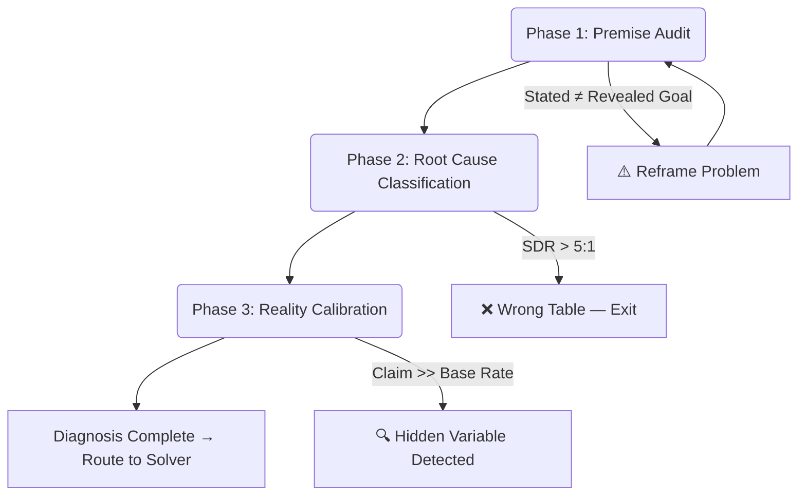
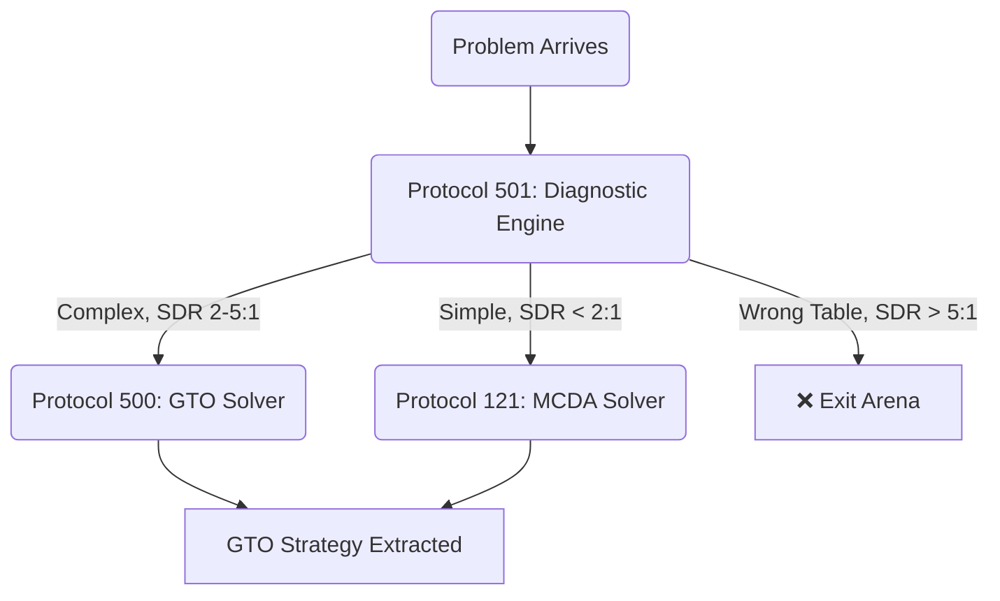

# Protocol 501: Diagnostic Engine (The Upstream Solver)

> **Created**: 2026-02-28
> **Domain**: Decision / Diagnosis / Meta-Cognition
> **Priority**: ⭐⭐⭐ Critical (Capstone Protocol)
> **Trigger**: Before ANY analysis; "What's actually going on?"; Repeated failure; "Why isn't this working?"
> **Prerequisite for**: Protocol 500 (GTO Solver), Protocol 121 (MCDA)

---

## Philosophy

> **"Solving the wrong problem perfectly is the most efficient path to failure."**
> — Einstein Protocol (55/5 Rule): Spend 11× more time defining the problem than solving it.

This protocol gates ALL downstream analysis. It answers the single most important question: **"What is actually happening?"** before you attempt to decide or solve anything.

Protocol 500 (GTO Solver) solves the **right** problem optimally.
Protocol 501 (Diagnostic Engine) ensures you **found** the right problem first.

---

## The Three-Phase Pipeline



---

## Phase 1: Premise Audit

> **Absorbs**: Protocol 111, Protocol 185, Protocol 123 (Einstein), Protocol 180 Phase I

**Purpose**: Validate that the problem as stated is the *actual* problem.

### The 6-Question Gate (60 seconds)

```
□ Q1: STATED vs REVEALED GOAL
  ├── Stated Goal: [What they say they want]
  ├── Revealed Goal: [What their ACTIONS optimise for]
  ├── Test: "If I gave you [stated goal] free tomorrow, would you take it?"
  └── Conflict > 20% → ⛔ STOP. Diagnose real goal first.

□ Q2: CORRECT LEVEL
  ├── Problem presented at: L[?]
  ├── Root cause actually at: L[?]
  │   L0: Tactical    ("Which tool to use?")
  │   L1: Strategic   ("How to win this game?")
  │   L2: Arena       ("Why am I playing this game?")
  │   L3: Archetype   ("Why this implementation?")
  │   L4: Existential ("Why pursue this at all?")
  └── Root cause 2+ levels above presentation → ⛔ STOP. Address higher level.

□ Q3: BASELINE MODEL EXISTS
  ├── "What does success look like, specifically?"
  ├── "What is the current state, measured?"
  └── No baseline → ⛔ STOP. Cannot measure progress without a baseline.

□ Q4: SURVIVORSHIP BIAS CHECK
  ├── "Am I looking at this because it succeeded, or because it's representative?"
  └── Cherry-picked evidence → ⛔ Flag and seek disconfirming data.

□ Q5: REVERSIBILITY CHECK
  ├── "Can I undo this decision if I'm wrong?"
  └── Irreversible + uncertain → Escalate to Protocol 500 (full GTO analysis).

□ Q6: CONSTRAINT AUDIT
  ├── "What am I NOT allowed to do?" (Legal, ethical, resource, time)
  └── Unconstrained problems are usually misframed problems.
```

### Phase 1 Output

```
PREMISE AUDIT:
  Stated Problem:  [X]
  Actual Problem:  [Y]
  Root Level:      L[N]
  Baseline:        [Exists / Missing]
  Reversible:      [Yes / No]
  
  VERDICT: [✅ PROCEED / ⛔ REFRAME — actual problem is: ...]
```

---

## Phase 2: Root Cause Classification

> **Absorbs**: Protocol 124 (SDR), Protocol 40 (Frame vs Structural)

**Purpose**: Once the actual problem is identified, classify *why* it exists.

### 2A: Frame vs Structural Taxonomy

| Failure Type | Definition | Example | Fix Category |
|:---|:---|:---|:---|
| **Frame Problem** | Same event, different narratives. Encoding ≠ Decoding. | "They think I'm arrogant" (but I'm just direct) | Fix the **optics** (communication, framing) |
| **Structural Problem** | System is architecturally broken. No amount of reframing fixes it. | "The market doesn't want this product" | Fix the **system** (pivot, redesign, exit) |

> **Critical Rule**: Never apply a Frame fix to a Structural problem. Never apply a Structural fix to a Frame problem. Misclassification wastes all downstream effort.

### 2B: SDR Calculation (Strategic Disadvantage Ratio)

```
SDR = Strategic Gap / Tactical Gap

Strategic Gap: "Am I at the right table?" (Things I CANNOT fix with effort)
Tactical Gap:  "Am I playing well at this table?" (Things I CAN fix with effort)
```

| SDR Ratio | Failure Type | Meaning | GTO Action |
|:---|:---|:---|:---|
| **< 2:1** | **A-Type (Variance)** | Winnable game, bad luck | ✅ Keep going — optimise execution |
| **2–5:1** | **Scouting Zone** | Something's off | 🟡 Investigate — audit assumptions |
| **> 5:1** | **B-Type (Structural)** | Wrong table entirely | ❌ Exit table — change arenas |

> **The Boxer's Fallacy**: When SDR > 5:1, most people respond by working HARDER at the WRONG TABLE. "Training harder" when the problem is "wrong weight class." The fix isn't "punch harder." The fix is "change rings."

### Phase 2 Output

```
ROOT CAUSE:
  Type:      [Frame / Structural]
  SDR:       [X:1] → [A-Type / Scouting / B-Type]
  
  VERDICT:   [✅ Optimise execution / 🟡 Audit assumptions / ❌ Exit table]
```

---

## Phase 3: Reality Calibration

> **Absorbs**: Protocol 140 (Base Rate Audit), Protocol 283 (Operational Realism), Protocol 261 (Skeptic Gate), Protocol 308 (Prima Facie vs Actuality)

**Purpose**: Calibrate your model of reality against statistical baselines and operational physics.

### 3A: Base Rate Audit

```
IF (Claimed Outcome) >> (Expected Outcome for Demographics)
THEN (Hidden Variable) EXISTS

Diagnostic: "What mechanism bridges the gap between Base Rate and Claim?"
```

| Check | Question | Red Flag |
|:---|:---|:---|
| **Demographic Base Rate** | "What % of people in my position achieve this?" | If claim > 2× base rate → Hidden variable |
| **Time Base Rate** | "How long does this typically take?" | If claim < 0.5× typical time → Unrealistic |
| **Cost Base Rate** | "What does this normally cost?" | If claim < 0.5× normal cost → Hidden cost exists |

### 3B: The Skeptic Gate (Anti-Single-Track Thinking)

When observing any signal, force **3 competing hypotheses** before acting:

| Hypothesis | Probability | Implication |
|:---|:---|:---|
| **Path A (Optimistic)** | [P₁]% | [Interpretation + Action] |
| **Path B (Neutral)** | [P₂]% | [Interpretation + Action] |
| **Path C (Pessimistic)** | [P₃]% | [Interpretation + Action] |

> **Rule**: Never bet the house on a single interpretation. If you cannot generate Path C, you are deluding yourself.

### 3C: Operational Realism Check (Kayfabe vs Physics)

| Dimension | Kayfabe (Social Narrative) | Physics (Operational Reality) |
|:---|:---|:---|
| **Power** | "We're all equal" | "Who controls the resource?" |
| **Incentives** | "They want to help" | "What are they PAID to do?" |
| **Timeline** | "It'll happen soon" | "What is the base rate timeline?" |
| **Consequences** | "Official policy says..." | "What actually happens to people who...?" |

### 3D: Prima Facie vs Actuality Gap

```
Gap = |What I think should happen| - |What the base rate says happens|

IF Gap > 30% → You are operating on "Inside View" (hope-based planning)
ACTION: Force switch to "Outside View" (base-rate-calibrated planning)
```

### Phase 3 Output

```
REALITY CALIBRATION:
  Base Rate Alignment:   [Aligned / Gap of X%]
  Hidden Variables:      [None / Detected: ...]
  Hypothesis Count:      [3 paths generated]
  Kayfabe Detected:      [Yes — in dimension: ... / No]
  
  CONFIDENCE LEVEL: [HIGH / MEDIUM / LOW — calibrated to base rates]
```

---

## Final Output: The Diagnosis

```
══════════════════════════════════════════════════
  PROTOCOL 501: DIAGNOSIS COMPLETE
══════════════════════════════════════════════════

  ACTUAL PROBLEM:     [Reframed from Phase 1]
  ROOT LEVEL:         L[N]
  FAILURE TYPE:       [Frame / Structural]
  SDR:                [X:1] → [A-Type / B-Type]
  REALITY CONFIDENCE: [HIGH / MEDIUM / LOW]
  
  ROUTING:
    SDR < 2:1   → Protocol 121 (MCDA — optimise execution)
    SDR 2-5:1   → Protocol 500 (GTO Solver — full analysis)
    SDR > 5:1   → EXIT. Change arenas. Do not optimise.
    
  FRAGILE ASSUMPTIONS:
    - [Assumption 1 — calibrated against base rate]
    - [Assumption 2 — monitor for trigger]
    
══════════════════════════════════════════════════
```

---

## Integration with Athena's Decision Stack



**The Three Pillars of Athena's Cognitive Stack:**

| Pillar | Protocol | Question It Answers |
|:---|:---|:---|
| **Diagnosis** | Protocol 501 | "What is actually happening?" |
| **Decision** | Protocol 121 | "Which option is best?" |
| **Problem Solving** | Protocol 500 | "What is the optimal move in a complex game?" |

---

## When NOT to Use This Protocol

| Situation | Do Instead |
|:---|:---|
| SNIPER-class query (Λ < 10) | Answer directly — don't overprocess |
| Well-defined problem with clear options | Skip to Protocol 121 (MCDA) |
| Emotional/therapeutic context | Use IFS Protocol first, not diagnostics |
| Emergency requiring immediate action | Act first, diagnose after (Law #1 override) |

---

## Cross-References

- [Protocol 500: GTO Problem Solver](<!-- Private: .agent/skills/protocols/ --> decision/500-gto-problem-solver.md) — Downstream solver
- [Protocol 121: MCDA / EEV / Pairwise](<!-- Private: .agent/skills/protocols/ --> decision/121-mcda-eev-framework.md) — Lightweight solver
- [Protocol 330: EEV](<!-- Private: .agent/skills/protocols/ --> decision/330-expected-aggregate-value.md) — Value engine
- [Protocol 193: Ergodicity Check](<!-- Private: .agent/skills/protocols/ --> decision/193-ergodicity-check.md) — Risk gate

## Protocols Absorbed

| Original Protocol | Status | Where It Lives Now |
|:---|:---|:---|
| Protocol 111: Premise Audit | **Absorbed** → Phase 1 | Protocol 501 Phase 1 |
| Protocol 185: Premise Validation Gate | **Absorbed** → Phase 1 | Protocol 501 Phase 1 |
| Protocol 123: Einstein Protocol (55/5) | **Referenced** — remains standalone as a philosophy | Phase 1 header |
| Protocol 124: SDR Diagnosis | **Absorbed** → Phase 2 | Protocol 501 Phase 2B |
| Protocol 40: Frame vs Structural | **Absorbed** → Phase 2 | Protocol 501 Phase 2A |
| Protocol 140: Base Rate Audit | **Absorbed** → Phase 3 | Protocol 501 Phase 3A |
| Protocol 283: Operational Realism | **Absorbed** → Phase 3 | Protocol 501 Phase 3C |
| Protocol 261: Skeptic Gate | **Absorbed** → Phase 3 | Protocol 501 Phase 3B |
| Protocol 308: Prima Facie vs Actuality | **Absorbed** → Phase 3 | Protocol 501 Phase 3D |

## Tags

# protocol #decision #diagnosis #premise-audit #sdr #base-rate #reality-check #capstone #upstream
