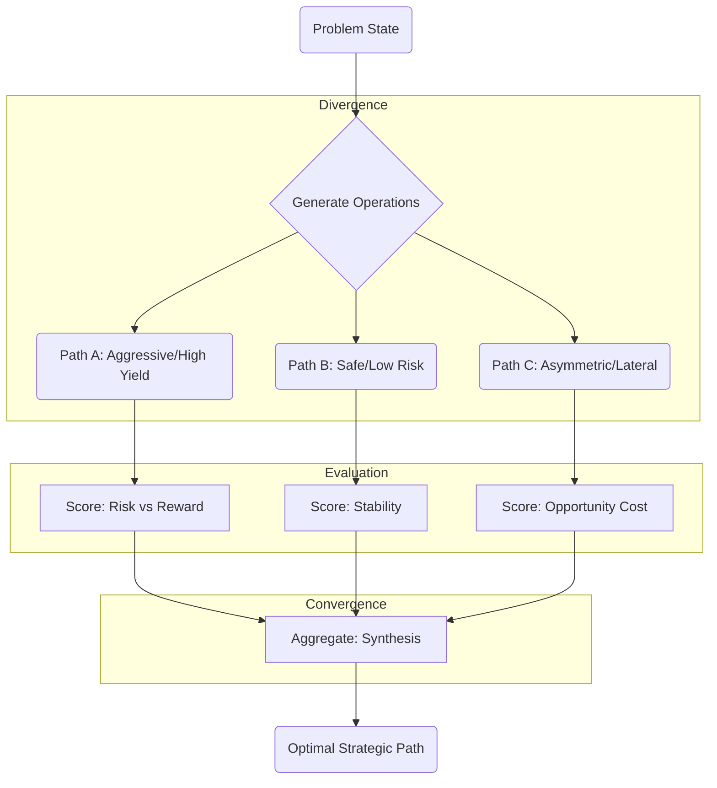

# Protocol 137: Graph of Thoughts (GoT) Decision Application

> **Source**: Adapted from ETH Zurich SPCL Graph-of-Thoughts ([arXiv:2308.09687](https://arxiv.org/abs/2308.09687), 2023)
> **Domain**: Decision / High-Stakes Strategy
> **Canonical Method**: See [Protocol 505: Graph of Thought](../reasoning/RSN-505-graph-of-thought.md) for the core GoT mechanics (Branch, Prune, Merge, Backtrack).
> **Priority**: ⭐⭐⭐ Critical (L4 Decision Gate)
> **Related**: [Protocol 123 (Einstein)](DEC-123-einstein-protocol.md), [Protocol 75 (Synthetic Parallel Reasoning)](DEC-75-synthetic-parallel-reasoning.md)

---

## Core Application

> **"Reasoning is not a Line. It is a Network."**

Standard decision-making evaluates options in isolation. **Protocol 137** applies Graph of Thoughts specifically to decision strategy when evaluating complex trade-offs (e.g. Einstein Protocol Phase 2).

For core method definitions (divergence, scoring, convergence, backtracking), consult the canonical source: **[Protocol 505: Graph of Thought](../reasoning/RSN-505-graph-of-thought.md)**.

---

## Decision Topology (Einstein Protocol Phase 2)

When executing **Phase 2 (Solution)** of the [Einstein Protocol](DEC-123-einstein-protocol.md), structure decision candidates as a network:

---

## 3. Operations Manual (AGoT Core Functions)

### A. `AdaptCompute(Lambda)` (Dynamic Router)
* **Rule**: Assess prompt complexity ($\Lambda$).
* If $\Lambda \le 30$: Execute single-pass linear reasoning (CoT).
* If $\Lambda > 30$: Spawn AGoT Dynamic DAG sub-graph.

### B. `Decompose(Node)` (Recursive Expansion)
* Split a complex sub-problem into 2–3 divergent hypothesis nodes.
* **Track Modes**:
  1. *Direct Track*: Formal logic & baseline mechanics.
  2. *Flanking Track*: Social dynamics, incentives, & game-theoretic moves.
  3. *Inversion Track*: Premise destruction & zero-action baseline.

### C. `EarlyPrune(Node)` (Immediate Ruin Filter)
* Before generating downstream steps, evaluate node against **Law #1 (No Ruin)** and the **Fuck-Unfuck Gate**.
* If `Risk of Ruin > 5%` or `Reversibility == False`, label node as `[PRUNED: Ruin]` and terminate branch immediately.

### D. `DynamicAggregate(Nodes)` (Cross-Branch Synthesis)
* Synthesize surviving non-pruned branches.
* Do not simply select one branch; extract the asymmetric upside of Branch B and buffer it with the structural safety of Branch A.

---

## 4. System Integration Note

* **Single-Context Decision Aid**: Protocol 137 / GoT is a single-context-window decision structure.
* **`/ultrathink` Distinction**: `/ultrathink` executes multi-channel parallel sub-agent reasoning (`parallel_orchestrator.py`) and does **not** invoke single-context GoT. Use DEC-137 during interactive single-session strategic decision framing.

---

## Tags

#protocol #decision #got #reasoning #topology #graph-of-thoughts

