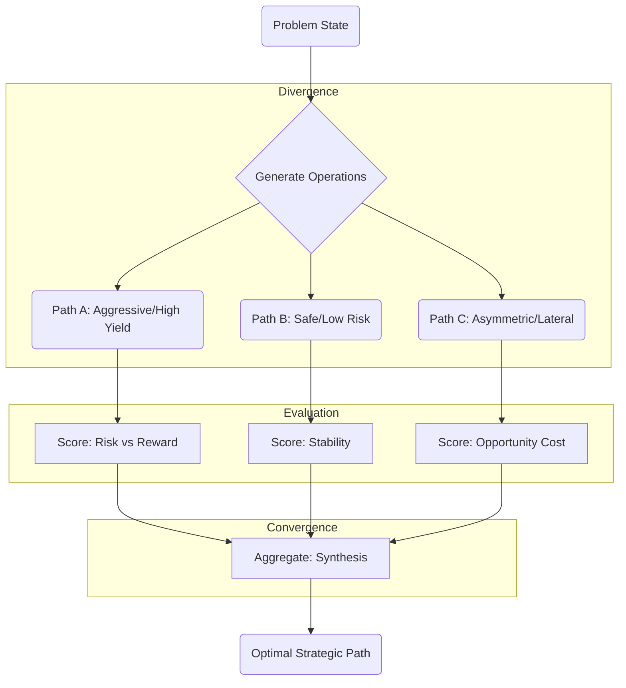

# Protocol 137: Graph of Thoughts (GoT) Decision Application

> **Source**: Adapted from ETH Zurich SPCL Graph-of-Thoughts ([arXiv:2308.09687](https://arxiv.org/abs/2308.09687), 2023)
> **Domain**: Decision / High-Stakes Strategy
> **Canonical Method**: See [Protocol 505: Graph of Thought](../reasoning/RSN-505-graph-of-thought.md) for the core GoT mechanics (Branch, Prune, Merge, Backtrack).
> **Priority**: ⭐⭐⭐ Critical (L4 Decision Gate)
> **Related**: [Protocol 123 (Einstein)](DEC-123-einstein-protocol.md), [Protocol 75 (Synthetic Parallel Reasoning)](DEC-75-synthetic-parallel-reasoning.md)

---

## Core Application

> **"Reasoning is not a Line. It is a Network."**

Standard decision-making evaluates options in isolation. **Protocol 137** applies Graph of Thoughts specifically to decision strategy when evaluating complex trade-offs (e.g. Einstein Protocol Phase 2).

For core method definitions (divergence, scoring, convergence, backtracking), consult the canonical source: **[Protocol 505: Graph of Thought](../reasoning/RSN-505-graph-of-thought.md)**.

---

## Decision Topology (Einstein Protocol Phase 2)

When executing **Phase 2 (Solution)** of the [Einstein Protocol](DEC-123-einstein-protocol.md), structure decision candidates as a network:

---

## Operations Manual (Applying GoT to a Decision)

> These are heuristics **you** apply while framing a decision — not functions the system executes. The canonical method (branch / prune / merge / backtrack) lives in [RSN-505](../reasoning/RSN-505-graph-of-thought.md); this section is its decision-domain application.

### A. Scale depth to stakes
* Low-stakes / reversible → answer directly (linear CoT). Don't build a graph for a coin-flip.
* High-stakes or high-complexity (Λ high) → structure the decision as a GoT network, per the steps below.

### B. Diverge — 2–3 candidate tracks
1. *Direct*: formal logic & baseline mechanics.
2. *Flanking*: social dynamics, incentives, & game-theoretic moves.
3. *Inversion*: premise destruction & the zero-action baseline.

### C. Ruin-prune (Law #1) — DEC-137's decision-specific filter
* Score each track against **Law #1 (No Ruin)** and the **Fuck-Unfuck Gate**.
* If a track carries non-trivial risk-of-ruin or is irreversible, kill it before developing it further. (This is a scoring criterion you apply; the `trading-risk-gate` skill owns any capital / position-sizing verdict.)

### D. Synthesize — don't just pick one
* Merge the survivors: take the asymmetric upside of one track and buffer it with the structural safety of another.

---

## 4. System Integration Note

* **Single-Context Decision Aid**: Protocol 137 / GoT is a single-context-window decision structure.
* **`/ultrathink` Distinction**: `/ultrathink` executes multi-channel parallel sub-agent reasoning (`parallel_orchestrator.py`) and does **not** invoke single-context GoT. Use DEC-137 during interactive single-session strategic decision framing.

---

## Tags

#protocol #decision #got #reasoning #topology #graph-of-thoughts

