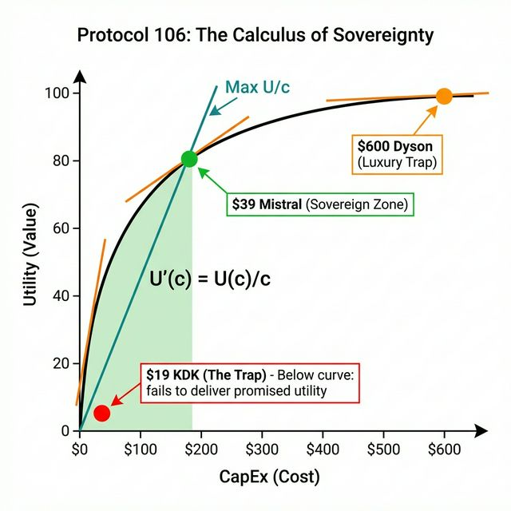

# Protocol 106: Min-Max Optimization

> **Core Theorem**: "Maximize the Utility Function (Indifference Curve) while Minimizing CapEx."
> **Metric**: Return on Effort (RoE).

---

## The Diagram

---

## How to Read This Chart

### The Axes

- **X-Axis (CapEx/Cost)**: How much money you spend.
- **Y-Axis (Utility/Value)**: How much benefit you get.

### The Black Curve

This is the **Utility Function**. It shows:

- As you spend more (move right), you get more value (move up).
- **But** the curve flattens (diminishing returns). The 600th dollar gives you less extra value than the 40th dollar.

### The Teal Line (Max U/c)

This is a **straight line from the origin** to the curve.

- The slope of this line = `Utility / Cost` = **Value for Money**.
- The **steepest possible line** that still touches the curve = **Maximum Value for Money**.
- The point where this line is **tangent** to the curve is the **Sovereign Zone**.

### The Three Dots

| Dot | Price | What It Represents |
|-----|-------|-------------------|
| 🔴 **Red** | $19 | **The Trap**. Cheap but broken/scam. Near-zero utility despite low cost. |
| 🟢 **Green** | $39 | **Sovereign Zone**. Optimal ratio of Utility to Cost. **BUY HERE.** |
| 🟠 **Orange** | $600 | **Luxury Trap**. High cost, marginal extra utility. Diminishing returns. |

### The Light Green Shaded Area

This represents **Total Value Captured** at the Sovereign Point.

- **Area = (Utility at Sovereign Point) × (Cost at Sovereign Point) / 2** (roughly, the triangle under the tangent).
- It visualizes that you're getting the **maximum "bang for buck"** — the largest possible value extraction for the dollars spent.
- Beyond the green dot, you spend more but the *additional* value shrinks (curve flattens).

---

## The Formula: When to Stop Spending

Given a Utility function $U(c)$ where $c$ is CapEx (Cost):

$$ S = \arg \max_{c} \left( \frac{U(c)}{c} \right) $$

At this optimal point $S$, the **Marginal Utility** (the derivative) equals the **Average Utility** (the slope of the ray from the origin):

$$ U'(c) = \frac{U(c)}{c} $$

### What This Means in Plain English

- **Keep spending** as long as the *next dollar* gives you *more* value than your current average.
- **Stop** the moment the next dollar gives you *less* value than your average.

| Zone | Condition | Action |
|------|-----------|--------|
| **Left of S** | $U'(c) > \frac{U(c)}{c}$ | Under-invested. Spend more. |
| **At S** | $U'(c) = \frac{U(c)}{c}$ | **Optimal. Buy here.** |
| **Right of S** | $U'(c) < \frac{U(c)}{c}$ | Diminishing returns. Stop. |

---

## Real-World Example: Fans

| Product | CapEx | Utility | U/c Ratio | Verdict |
|---------|-------|---------|-----------|---------|
| **$19 KDK (Fake)** | $19 | ~0 (Breaks instantly) | 0 | ❌ **Trap** |
| **$39 Mistral** | $39 | ~80 (Solid airflow, 5yr life) | **2.05** | ✅ **Sovereign** |
| **$600 Dyson** | $600 | ~100 (Quieter, prettier) | 0.17 | ⚠️ **Luxury Trap** |

**Verdict**: Buy the Mistral. The Dyson gives you +20 utility for +$561. That's $28/utility point. The Mistral gives you 80 utility for $39. That's $0.49/utility point. **57x more efficient.**

---

## The Three Pillars of Application

### 1. Procurement (Buying Stuff)

- **Goal**: Maximize Utility per Dollar.
- **Application**: $39 Mistral fan > $600 Dyson fan.

### 2. Operations (Doing Work)

- **Goal**: Maximize Output per Keystroke.
- **Application**: Use Athena to draft emails instead of writing manually.

### 3. Energy (Living Life)

- **Goal**: Maximize Impact per Calorie.
- **Application**: 80/20 Rule — "Good enough" at 20% effort beats "perfect" at 100% effort (when stakes are low).

---

## The Sovereign Standard

> **Amateur**: Maximizes Output at *any* cost (Burnout).
> **Sovereign**: Maximizes Output at *minimum* cost (Sustainability).

*"The ultimate sophistication is getting the result without doing the work."*
